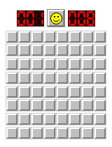

# js-minesweeper
My own version of Minesweeper, built using the assets of Microsoft Minesweeper from Windows 95.

This is under the MIT Lisense, so you can do whatever you really want with it.
Functionality built off of a [GeeksforGeeks template](https://www.geeksforgeeks.org/create-a-minesweeper-game-using-html-css-javascript/), then continued forward by myself.